> #### Get your conecpts straight

* Intution and concepts constitute...the elements of all our knowledge, so that neither concepts without an intution in some way corresponding to them, nor intution without concepts can yield knowledge

* Analyze, develop and organize concepts visually in maps
* A concept map of an agreement looks like this 
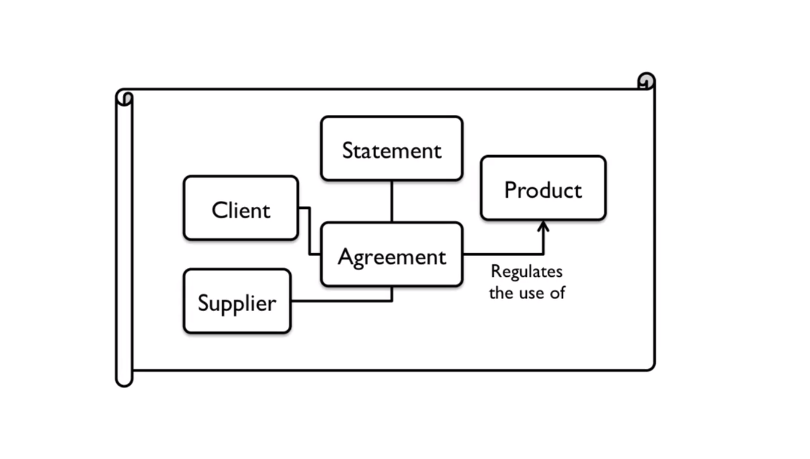

* And after labelling the elements of a concept map, this is what it looks like 😄

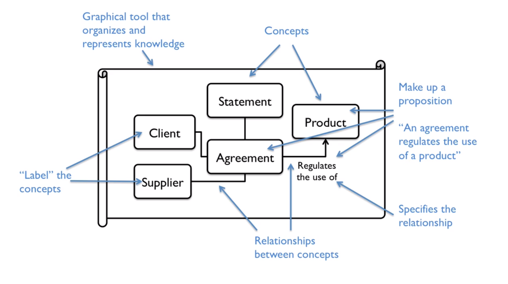

* We use these conceptual maps to 
    * Boost knowledge acquisition (requiring new knowledge)
    * Communicate / Teach more clearly
    * Develop better systems ( business or IT). This is a 🔑 key tool
    * Improves creative thinking
* Concept Mapping was developed by Joseph Novak in 1970's for __knowledge development in children__
* The concept map of UDEMY looks like this - 
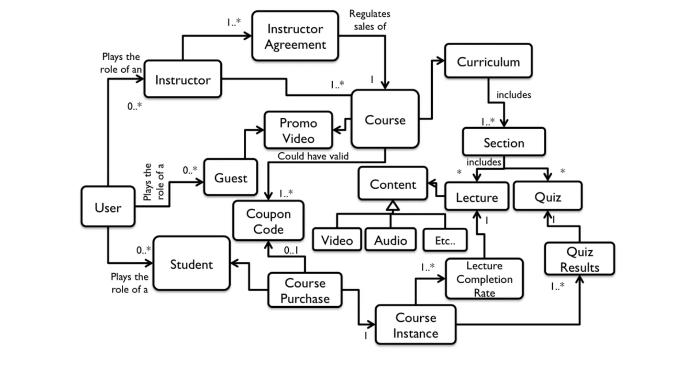
* Brialliant... isn't it? 😆 😆

* Uses of Concept Maps
    * Note-Taking / Summarization of conepts and their relationships / Hierarchy of conceptual relationships and oncepts
    * Examining the symmetry of complex ideas and arguements
    * Transformation tactic knowledge into organizational resource
    * Communicating complex ideas and arguements
    * Detailing the entire structure of an idea or line or arguement for the scrunity of others
    * __Designing business models, products, institutions and scientific theories__ 🏆 🏆
    * Developing software systems and databases
    * Creating Metrics to measure business performance (User Activity / Application Load Times etc 😄)

* The course structure looks like as follows 
* 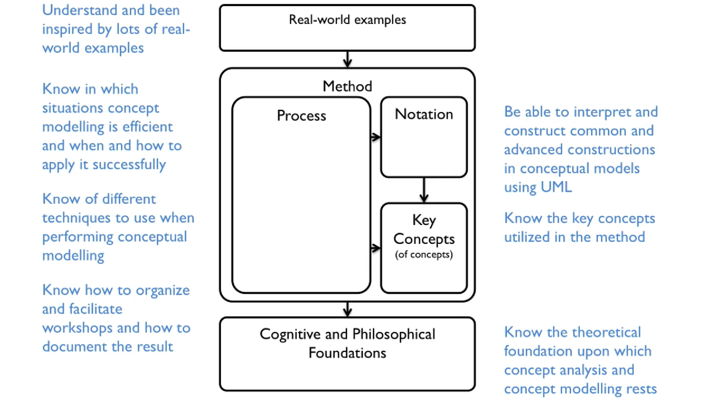

## Philosophical Section - Talk about Concepts and its types (__first part of the ogden's triangle__)
---

> So how do we go from  electrons to elections ? 🤔 from protons to presidents ? 🤔
* We seem to be building so many concepts from our physical environment.. Wtf is going on here bro ? 
* From stars ⭐️ 🌔 moon to spaceships, people 🙎 to government 🎏 🎏 🎏
* How do we do this ? Think for it for a sec ⌛️
* We are going from brute facts to social facts 
* 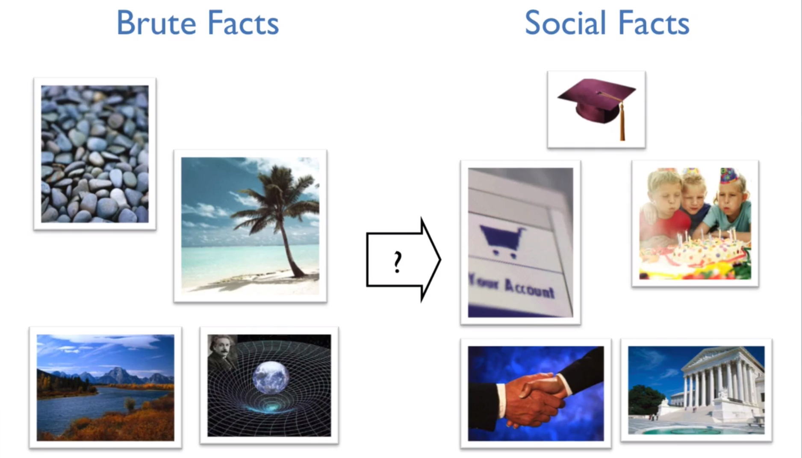

* From sand, stones, trees to birthday parties, accounts, institutions and governments

* Process of creating new social facts
    * Envisioning new concepts
    * Declaring them using language
    * Getting collective acceptance on their validity
    * Assigning them to already accepted facts using declarations
    * Getting a collective acceptance on the assignment
    * New Social Fact Created
    * Envision new concepts based on the present conept and repeat this cycle from top to bottom
    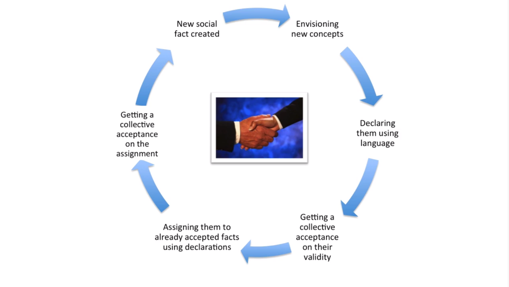

    * There are elements that exist independently of mankind's existance - stars, sand, trees
    * There are tools that we use and threfore exist coz we created them - hammers, table, fork, engine, piano 
    * There are birthday parties, money, president, load, degree/diplaom (which you dont have lol 😆 😆)
    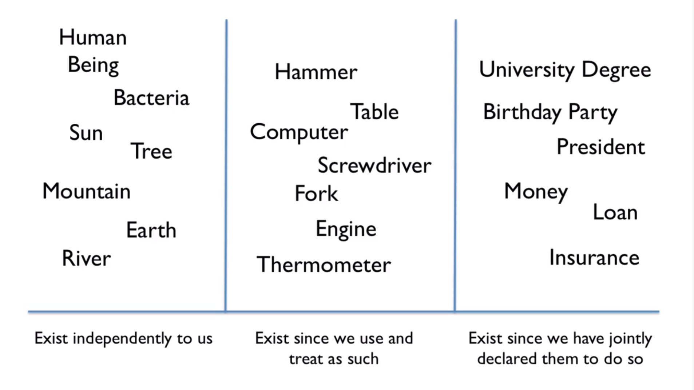
    * Basically this is what we are doing when we are creating / developing products/ IT systems 
    * Envisioning new social concepts and assigning them in the world and getting a collective acceptance about them from everyone around 
    ---
    * Look at the following example
    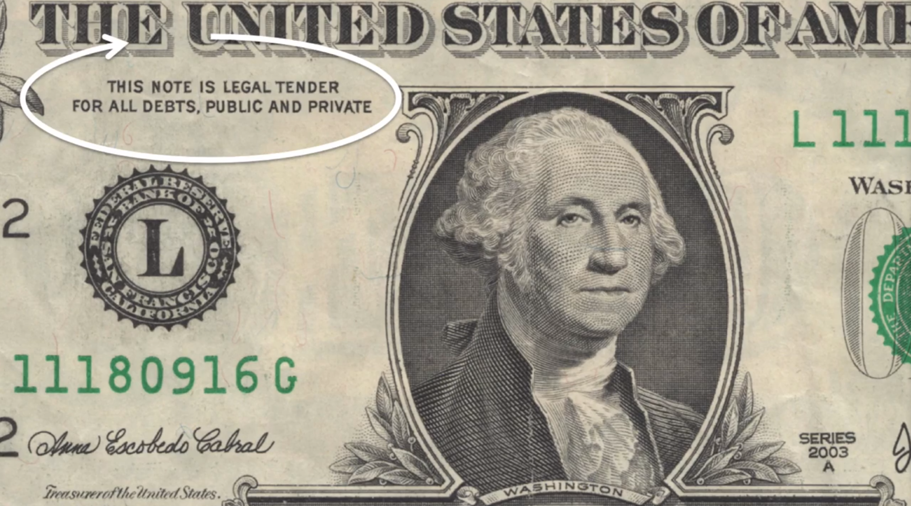
    * Look at the text marked inside the white arrow -- What does it say? 
    * __THIS NOTE IS A LEGAL TENDER FOR ALL DEBTS, PUBLIC AND PRIVATE__
    * 🤔 what is this ?
    * Well, this is a declaration. This is how a social fact is created
    * 💰 money is a social fact created by us 👱 👱
    * If we do not exist, money does not exist
    * But how did we establish this concept of money in the first place ? Lets find out...
        * Paper exists 📰 It is an object 📦
        * Then we have concepts about what paper is in our minds 
        * We have concepts about the properties that belong to the concept (paper 📰)
            * The paper is brown in color
        * So we have concepts in our minds that have properties 
        * For example, in our minds, we have concept of paper, then the paper is brown is also a property that exists in our minds that tells us that the property brown is attached to the concept paper in some way
    * Paper is a brute fact
    * This becomes the propositional content and is called the intentional state.
    * Intentinal states can be of two types - beliefs and desires (atleast for this course, There can be more too, but for this course, 2 is sufficient to understand the course)
    * the concept of paper, the property of brown attached to the paper colllectively becomes the proposition. 
    * Then I can state this proposition as an intentional state using language. 
    * I can say 👱 - This paper is brown 
    * Here I made a statement, and used terms in my statement to refer to both
        * concepts in my mind
        * the actual object 📦 in the world 🌍
    * So speech act kinda kills two birds with one stone. Through statement, we refer to conept in our minds and objects in the world
    * This statement falls under the category of speach act and in this case, it is an assertion. ofcourse there are more types of speech acts and I will read about them down below as I proceed further. This is just the surface my dude..... 😆
* Now I can envision the concept of money
* I can then connect the new concept of money 🤑 to the existing concept of paper. object 📦 ----> becomes  ----> ️money 💰
* The belief of paper counting as money becomes another intentional state now. First it was just a paper, now it is money. 
* New concept created.
* Now I need to declare it in the real world so that others can also have the same concept 
* So I use speech act to say, __"paper can count as money"__. 
* But this is not an assertion. This is a declaration. 
* because money will not exist if only I think of it as moeny. 
* It is just a piece of paper untill everybody else recognizes it as money. Coz money is a property that does not intrinsically (le nya word bhi seekh bosdi ke) exist as a property of paper. Its something I came up with
* If nobody else recognizes it as what I recognize it ( as monety ), then no use. Good luck, ghar jaao lol 😆
* Declaration is necessary to get a collective acceptance to make a social fact. 
* Think of it, Tugdu (jhan parin nai jaa paata that bas mai, kitu aur sharyn jaate the, that place does not exist for anyone else. it was a collective acceptance of us 4 people. We created it, therefore, it is not a social fact as it doesn not have a collective acceptance from others people of the world)  
* Another example, the concept of dog exists, Thuiland does not. Only my family knows that thuiland is.
* LOL ye sab koi scientist dekhega en the next 3000 years if mankind still exists, bechara paagl ho jyga soch soch ke ke wtf is this guy talking about.. who was thuiland lol. 
Coming back to the discussion 😆 , a concept must be declared in order to have a collective acceptance of it from others to turn in into a social fact
* When I declate, __"This paper count as money"__ through speech act
* This is when I use a status function to top of a piece of paper and turned it into money, then it will turn it into money and that is if and ONLY if, other people also collectively accept that this piece of paper is moeney
* Also a very important is that the other people have an intentional state about my intentional state
    * My intentional state that this brown piece of paper is moeny
* The other people have an intentional state about my intentional state of belief that this is money 
* I have an intentional state about others they too believe that this piece of paper is money
* So I have an intentional state about their intentional state of believing this piece of paper as money
* Basically, I know that they pretend that this is money and they know that I pretend that this is money LOL 😆 😆
* Everyone pretends that this brown piece of paper is money and everyone knows that everyone pretends that this is money
* This is what a collective intentiaonl state is. A collective acceptance of others preteding that this is money. 
* IMPORTANT - collective intentinality not just invove having a collective acceptance of counting  a piece of paper is money, __It also includes that collective acceptance of others collective intentionality that this piece of papaer is money__. 
> is upar vale point pe dimaag lga lio bhai ye thora tedha hai 😆
* Now money is created. Now  is the time when a new social fact is created. 
* basically this is how we create all these social realities - birthday parties, government, teacher, distance, IT systems , products
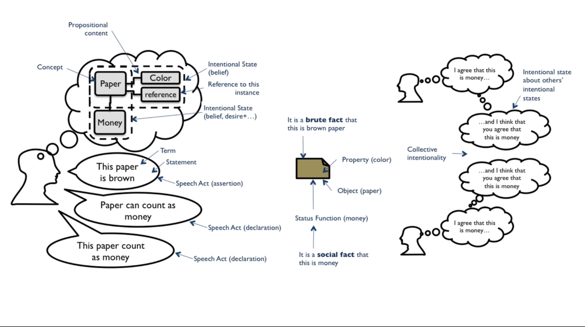

* Once we have created the concept of money in everyone collectively, Recurrsion does the rest for us.
* Now we can continually invent other concepts based on the present concepts
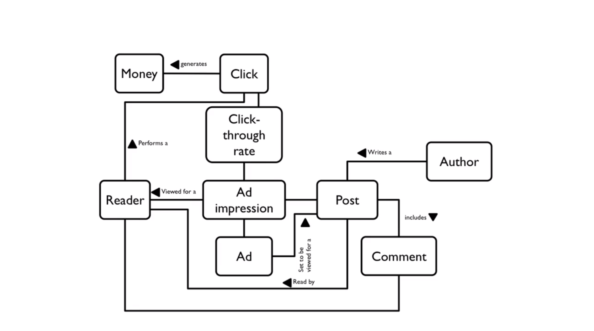

* Now these social facts are created with the help of three components
    * The meta physics of the objects of the world 📦 🌴 🍰 ( Philosophy of objects)
    * The concepts in our minds about those real world objects 👱 ( Philosophy of mind)
    * What we say using speech acts and declare new social facts 🗣 💬 🔈 ( Philosophy of language)

    * This is what the Ogdens triangle looks like
    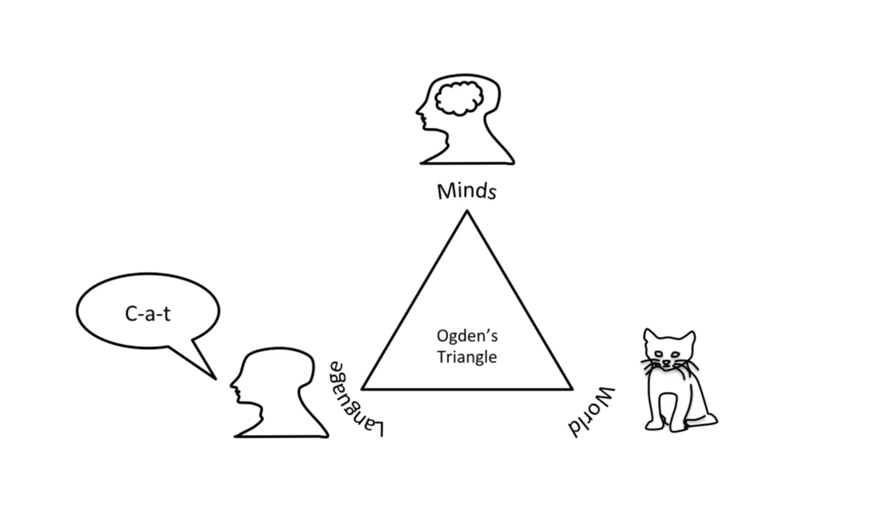
    * And this is the concept map of the above Ogdens Triangle 😆 😆
    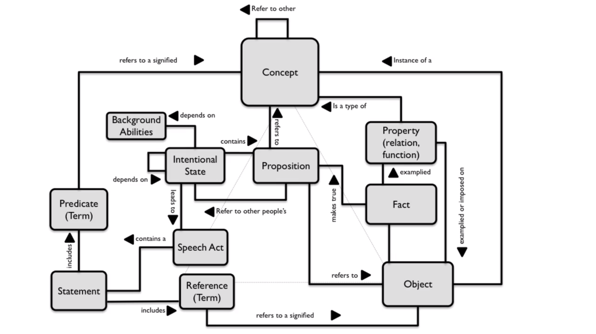
    * Explanation of conceptual model of Ogdens Triangle, all these relations being talked about below can be seen in the above figure. 
        * We have objects
        * Objects are instances of concepts
        * Concepts refer to other concepts ( Concepts refer  to other conepts)
        * We have terms that reference the objects
        * We have other terms that reference other concepts such as Predicates
        * We have propositions that connect concepts to objects and concepts to other concepts
        * Intentional states contain propositional content
        * Intentional states depend on other intentional states
        * Intentional states also depend on background abilities
        * Speech Act is the result of an intentional state
        * Speech Act includes a Statement that connects predicates and references to objects
        * Propositional Content in the intentional state can also refer to other peoples intentional state. This is when we get collective intentionality
        * We have properties on objects - which are a type of concept 
        * We assign properties to object - Property types -
            * Functions
            * Relations
            * Singular Property - Color, Weight, Size
        * Properties are examplified and imposed on objects
        * Facts are created when an object examplifies properties 
        * Fact is what makes a proposition true

        ------------------------------------
## Philosophical Foundations of Conceptual Analysis
* Why is visualization of concepts so effective?
    * It is more expressive than just writing text or speaking words. 
    * Visuals are basically more effective for us humans
    * Sense of sight is strong
* However, there is a problem, the concepts can be hetrogenous
    * What this means is that concepts can have different meanings for different people
    * In other words, different people can have different meanings for a term 
* In this case, even concept maps can be rendered ineffective. 
* Communication of ideas is the main goal of a concept map and if the meaning of a concept is interpretted wrong, then the concept map fails in its purpose. 
* Therefore, it is very important that everyone in the business meeting must have a similar concept for a particualr term being used in the discussion or the concept map. 
* When in a business meeting, some people have the power of declaration. 
    * Some people only assert an idea, this is this or that is that
    * However, some person might be a senior or a domain expert who might this means this or that means that,this second type of people are the ones that alter the world 
> In Summary, Visualizing concepts make
* Transfer of knowledge easier
* Help in acquiring new knowledge
* Help spot knowledge differences
* Makes clearer which declarations are made
* Makes easier to brainstorm and create complex systems

---

> Philosophy is like a safe. You can keep moving all the little parts and it will feel like there is no outcome at all and all the efforts are futile. HOWEVER, once all the pieces are aligned and moved at the right angle in a very specific way, the safe opens and new knowledge is discovered

* Here is the breakdown of the Ogdens Triangle in the form of a downward flowchart
* It is all what we have talked before but just in a different formant just to park the cr right up the alley

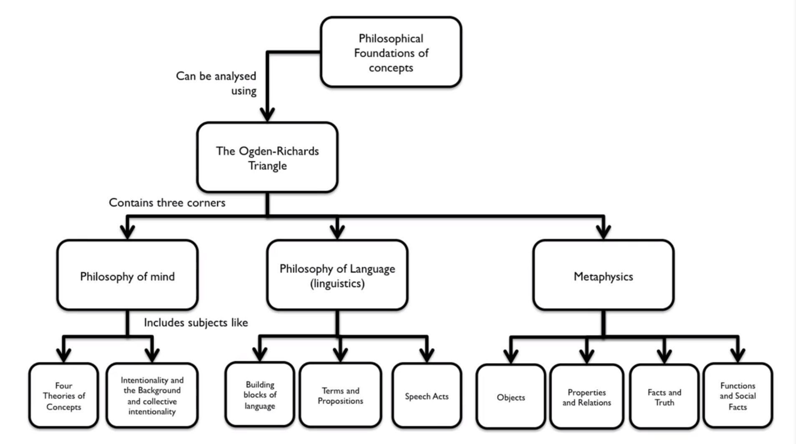

* The philosoply mind consists of the concept of conepts
* The concept of concept has 4 different parts

* On a basic level, concepts are the constituents of thoughts
    * The Classical Theory
    * The Prototype Theory
    * The Theory Theory
    * The Conceptual Atomism Theory